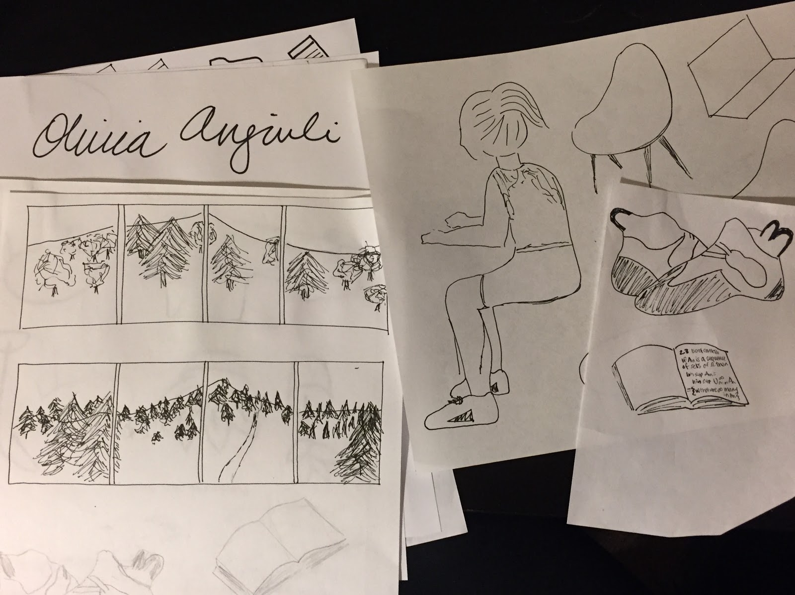
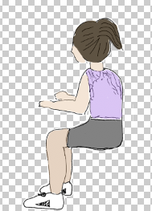
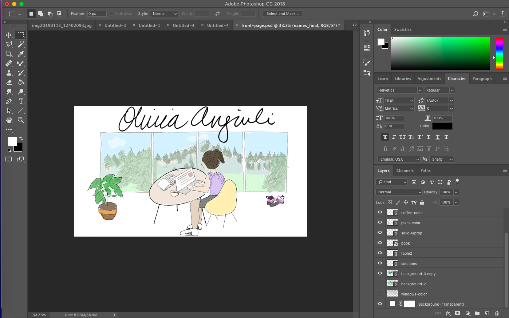
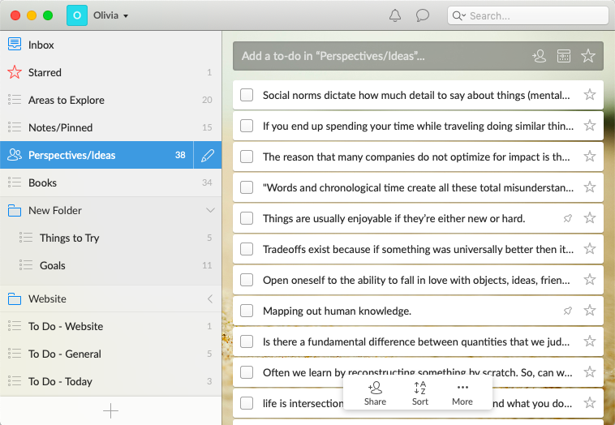
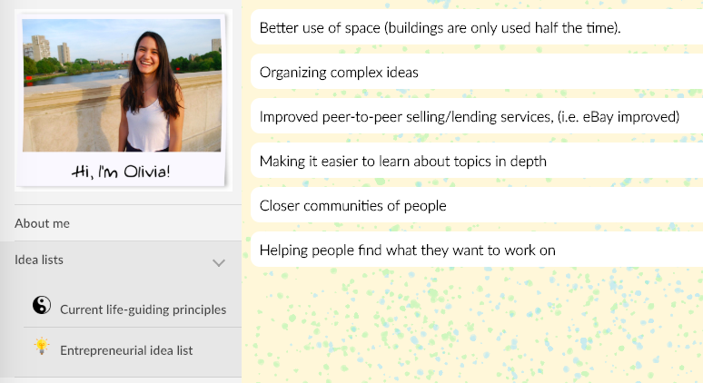

## Why have a website?

Before college, everyone that mattered to me knew me personally.

But in the years after college, making a website gained appeal.  _I_ most often stumble upon others’ personal websites if I Google them before meeting them for the first time (it’s nice to have some background on them, eh?).  Assuming that others do the same for me, it’d be nice to have a corner of the web that represents who I am.

## Alright, so who are you?

The first idea I had was to have a flashy website, something that played on what an athlete or a movie star’s website may be.  Something like this (Jimmy Chin’s website) where the vibe just shines through, and I was picturing some kind of looping video of me playing in the background.  But I could not get a concrete idea of what such a video would be (nor, admittedly, did I try that hard).

Then, I went on a trail-running vacation with my high school friend Michele in which I pulled up my Wunderlist on my computer, where I keep a running list of some of my cooler, unique ideas.  I also have lists for things I’ve read, moral principles that guide me, to-do lists, etc.   I realized, this is a pretty good representation of who I am!  Maybe this is what my website should be -- a list of ideas that are interesting and inspiring to me.  That should give  a good feel of who I am.

I visualized that I’d first have a homepage (how it currently stands) -- a drawing of me on a laptop -- and the idea was that you’d click on the laptop and be “transported” into my Wunderlist, where you can explore my ideas.

## The making of the homepage

All of the drawings were originally hand-drawn by Sharpie or pen:

After that, I scanned each of the sheets of paper in, and colored each object with brushes:

… and then combined them to an overall image in Photoshop!

The laptop and climbing shoes are made clickable by using  image-maps (https://www.image-map.net/), and the rest is just standard HTML and CSS.

## The attempt at Wunderlist

Now it was time to implement the Wunderlist!  Here is a snapshot of my Wunderlist as it stands on my computer right now:

I spent a few weeks coding up a pretty convincing mock-implementation of Wunderlist using a jQuery plugin called mmenu.  Here’s what it looked like!

But the design fell short of being ideal for a personal website.  The short snippets of ideas, as pictured above, did not have enough detail for people other than me to fully understand the idea.  Even my boyfriend Kao and Michele, both of whom know me very well, expressed the sentiment of “not knowing what to do with this information” or not really being compelled to explore it further.

That’s how it morphed into its current form, where it’s become clearer that you’re being “sucked into my laptop”, but within this playful layout, it has a more traditional form where the entries are more self-sufficient and will build up over time.

Enjoy!